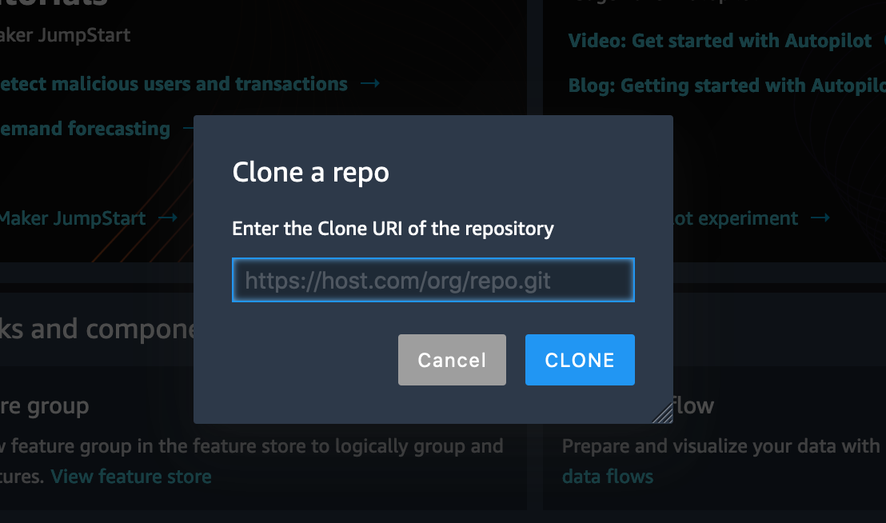

# Predict Bike Sharing Demand with AutoGluon

## Introduction to AWS Machine Learning Final Project

## Overview
This project focuses on predicting bike-sharing demand using the AutoGluon library for the Bike Sharing Demand competition on Kaggle. By utilizing tabular prediction techniques, we aim to fit data from CSV files provided by the competition. The project demonstrates proficiency in using AutoGluon to train multiple models and optimizing solutions for the given problem.

Bike-sharing demand prediction is crucial for companies like Uber, Lyft, and DoorDash, as it helps them prepare for spikes in their services and improve customer experience by minimizing delays.

In the end, the project involves submitting multiple entries to the competition and achieving a rank within Kaggle. Additionally, a detailed report of findings will be compiled, which can be shared publicly on Kaggle or personal platforms to showcase the work done.


## Getting Started
* Clone this template repository `git clone git@github.com:udacity/nd009t-c1-intro-to-ml-project-starter.git` into AWS Sagemaker Studio (or local development).




* Proceed with the project within the [jupyter notebook](project-template.ipynb).
* Visit the [Kaggle Bike Sharing Demand Competition](https://www.kaggle.com/c/bike-sharing-demand) page. There you will see the overall details about the competition including overview, data, code, discussion, leaderboard, and rules. You will primarily be focused on the data and ranking sections.

### Dependencies

```
Python 3.7
MXNet 1.8
Pandas >= 1.2.4
AutoGluon 0.2.0 
```
### Key Components
AutoGluon: Utilized for training several iterations of models.
Tabular Prediction: Technique used for fitting data from CSV files.
Kaggle Competition Submission: Multiple entries submitted to the Bike Sharing Demand competition.
Report: A detailed report of findings compiled to share publicly on Kaggle or personal platforms.

### Acknowledgments
This project was completed as part of the Udacity Nanodegree course (Machine Learning Fundamentals), utilizing the provided resources and guidelines.


