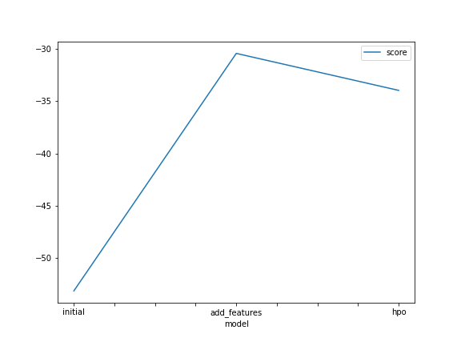
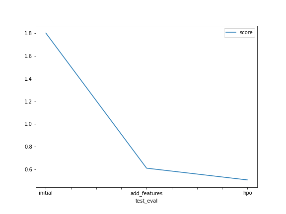

# Report: Predict Bike Sharing Demand with AutoGluon Solution
#### RUKAYAT ADEDEJI

## Initial Training
### What did you realize when you tried to submit your predictions? What changes were needed to the output of the predictor to submit your results?
TODO: I had to ensure all predicted value was positive number as it is predicting the order counts and it would be inpossible to have a negative number of orders.  Predicting negative counts is unrealistic because bike sharing demand cannot be negative. It is therefore crucial to ensure the output aligns with real-world constraints, such as non-negativity.

### What was the top ranked model that performed?
TODO: WeightedEnsemble_L3 was the top ranked model from the three training runs. This is not surprising because WeightedEnsemble_L3 combines predictions from multiple diverse base models, each trained using different algorithms and/or hyperparameters. This diversity allows the ensemble to capture different aspects of the underlying data and model the relationships between features and the target variable better.

## Exploratory data analysis and feature creation
### What did the exploratory analysis find and how did you add additional features?
TODO: Plotting the histogram of all the features showed us the different distributions and help us differentiate the categorical labels from continuous numbers.
I created 5 extra datetime columns(hour, day, week, month and year) from the 'datetime' columns. This was done to provide detailed insights into temporal patterns that might in it enhancing the learning outcome. For instance, orders recieved could vary by the hour of the day or month of the year. So making this a feature in the training data would allow the models train better if relationships are found.
Also, the datatype of the 'season' and 'weather' column was set to category to ensure the Autogluon treat the numbers there as category instead of numerical.

### How much better did your model preform after adding additional features and why do you think that is?
TODO: My model perfrmance increased significantly after adding more features to the data. The kaggle score reduced from 1.80344 to 0.61088 indicating distance between the predicted and actual count value is smaller and closer. I think this improvement occured because there was an underlying pattern between the order counts and  seperated time features which was better captured on a granular level.

## Hyper parameter tuning
### How much better did your model preform after trying different hyper parameters?
TODO: My model performance increased slightly after trying different hyperparameters from the default. The score reduced to 0.50732 indicating the predicted value is closer to the actual value than in previous setting.

### If you were given more time with this dataset, where do you think you would spend more time?
TODO: I think i will spend more time training the dataset individually on the top 5 performing algorithm and try them with different hyperparameters to study how each changes affect the model and which setting would give the best prediction

### Create a table with the models you ran, the hyperparameters modified, and the kaggle score.
|model|hpo1|hpo2|hpo3|score|
|--|--|--|--|--|
|initial|-53.137922|-53.444992|-55.076511|1.80344|
|add_features|-30.440743|-30.711589|-31.140419|0.61088|
|hpo|-33.975272|-33.975272|-34.941020|0.50732|

### Create a line plot showing the top model score for the three (or more) training runs during the project.

TODO: Replace the image below with your own.

### Create a line plot showing the top kaggle score for the three (or more) prediction submissions during the project.

TODO: Replace the image below with your own.

## Summary
TODO: In summary, the report highlights the iterative process of model development, from data exploration to feature engineering and hyperparameter tuning. During each iteration, we closely monitiored how various changes impacts model performance in order to achieve the most accurate predictions.
The project shows the importance of thoughtful model construction in achieving accurate predictions.
